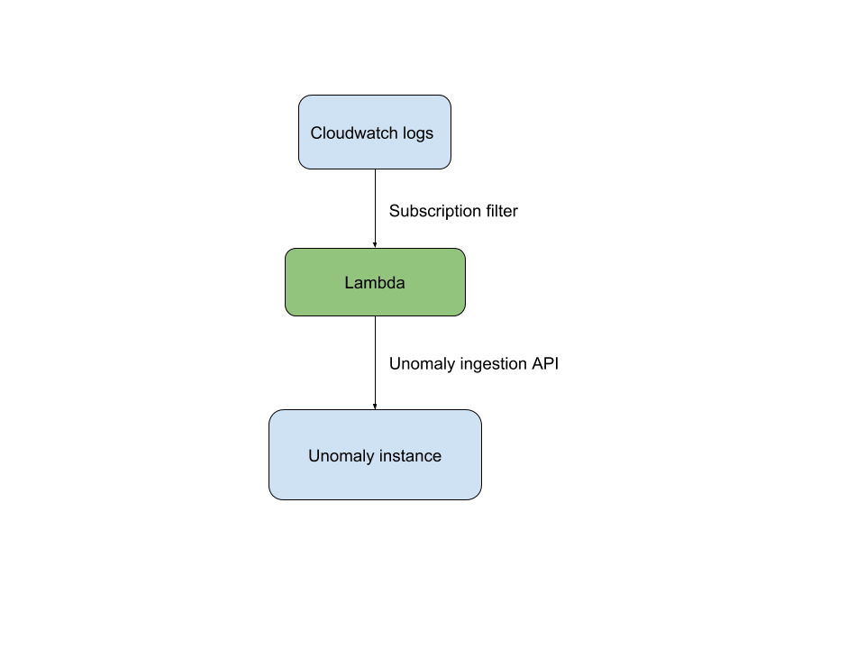

# AWS ingestion lambdas

This repo contains lambdas to push logs from AWS to [Unomaly](https://unomaly.com)

## Ingesting cloudwatch logs

You can easily setup cloudwatch logs ingestion by starting this [Cloud formation stack](https://console.aws.amazon.com/cloudformation/home#/stacks/new?stackName=unomaly-cloudwatch&templateURL=https://s3-eu-west-1.amazonaws.com/unomaly/releases/aws/cloudwatch-0.1.0/sam-cloudwatch-logs.yml).
It will create the lambda function as well as the subscription to the log group of your choice.

Environment:

- UNOMALY_HOST : Unomaly host address (mandatory)
- KEEP_TIMESTAMP: If set to false, Unomaly will use its own ingestion timestamp as the event's timestamp
- BATCH_SIZE: Event batch size to send to Unomaly. Increasing it could lead to better performance but also higher memory usage. (Default is 100)
- ACCEPT_SELF_SIGNED_CERTS: Accept self signed certificates 

 

## Contributing
 
 Bug reports and pull requests are welcome. This project is intended to
 be a safe, welcoming space for collaboration.